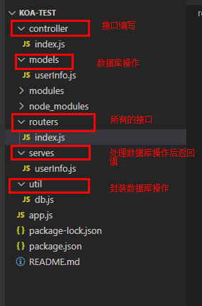
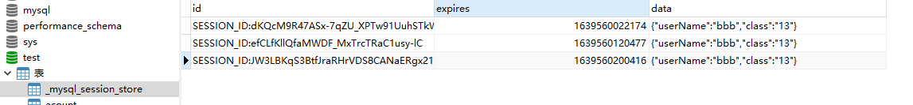

## 插件

### **file-saver**

导出文件

### **vuedraggable**

Vue.Draggable是一款基于Sortable.js实现的vue拖拽插件

### **vue-pdf**

pdf文件在线预览

### **vue-count-to**

数字滚动插件

### **qs**

增加了一些安全性的查询字符串解析和序列化字符串的库

> qs.parse()是将URL解析成对象的形式
>
> - qs 允许在查询字符串中使用`[]`的方式创建嵌套的对象
>
>   ```
>   assert.deepEqual(qs.parse('foo[bar]=baz'), { foo: {  bar: 'baz' } })
>   ```
>
> - 可以解析 URI 编码
>
>   ```
>   assert.deepEqual(qs.parse('a%5Bb%5D=c')  ==  { a: { b: 'c' } })
>   ```
>
> qs.stringify()是将对象 序列化成URL的形式，以&进行拼接
>
> - 默认情况下，对象序列化后进行URL编码后输出
>
>   ```
>   assert.equal(qs.stringify({ a: { b: 'c' } }), 'a%5Bb%5D=c');
>   ```
>
> - 通过设置 `encode` 为 `false` 禁止 URI 编码
>
>   ```
>   var unencoded = qs.stringify({ a: { b: 'c' } }, { encode: false });
>   assert.equal(unencoded, 'a[b]=c');
>   ```
>
> - 通过设置 `encodeValuesOnly` 为 `true`，可以禁用对 key 进行URI 编码
>
>   ```
>   var encodedValues = qs.stringify(
>     	    { a: 'b', c: ['d', 'e=f'], f: [['g'], ['h']] },
>     	    { encodeValuesOnly: true }
>     	);
>     	assert.equal(encodedValues,'a=b&c[0]=d&c[1]=e%3Df&f[0][0]=g&f[1][0]=h');
>   ```
>
>   
>
> ------
>
>   [^assert.equal(actual, expected[, message\])]: 判断实际值(actual)与期望徝(expected)是否相等(==)，如果不相等，则抛出一个message的错误。

### cryptoJS

crypto-js([GitHub](https://link.jianshu.com/?t=https%3A%2F%2Fgithub.com%2Fbrix%2Fcrypto-js))是谷歌开发的一个纯JavaScript的加密算法类库，可以非常方便的在前端进行其所支持的加解密操作。目前crypto-js已支持的算法有：MD5,SHA-1,SHA-256,AES,Rabbit,MARC4,HMAC,HMAC-MD5,HMAC-SHA1,HMAC-SHA256,PBKDF2。常用的加密方式有MD5和AES，使用时可以引用总文件，也可以单独引用某一文件。

*直接引用*：引入crypto-js文件。

*安装依赖*：npm install crypto-js     import CryptoJS from 'crypto-js'。

```
function getAesString(data,key,iv){//加密
    var key  = CryptoJS.enc.Utf8.parse(key);
    var iv   = CryptoJS.enc.Utf8.parse(iv);
    var encrypted =CryptoJS.AES.encrypt(data,key,
        {
            iv:iv,
            mode:CryptoJS.mode.CBC,
            padding:CryptoJS.pad.Pkcs7
        });
    return encrypted.toString();    //返回的是base64格式的密文
}
function getDAesString(encrypted,key,iv){//解密
    var key  = CryptoJS.enc.Utf8.parse(key);
    var iv   = CryptoJS.enc.Utf8.parse(iv);
    var decrypted =CryptoJS.AES.decrypt(encrypted,key,
        {
            iv:iv,
            mode:CryptoJS.mode.CBC,
            padding:CryptoJS.pad.Pkcs7
        });
    return decrypted.toString(CryptoJS.enc.Utf8);     
}

function getAES(data){ //加密
    var key  = 'AAAAAAAAAAAAAAAAAAAAAAAAAAAAAAAA';  //密钥
    var iv   = '1234567812345678';
    var encrypted =getAesString(data,key,iv); //密文
    var encrypted1 =CryptoJS.enc.Utf8.parse(encrypted);
    return encrypted;
}

function getDAes(data){//解密
    var key  = 'AAAAAAAAAAAAAAAAAAAAAAAAAAAAAAAA';  //密钥
    var iv   = '1234567812345678';
    var decryptedStr =getDAesString(data,key,iv);
    return decryptedStr;
}
```

### fastclick

移动设备上的浏览器默认会在用户点击屏幕大约延迟300毫秒后才会触发点击事件，这是为了检查用户是否在做双击。为了能够立即响应用户的点击事件，才有了FastClick

### font-awesome

[font awesome](http://www.fontawesome.com.cn/)字体图标库

### html2canvas

[html2canvas](https://html2canvas.hertzen.com/documentation) 是一款利用javascript进行屏幕截图的插件

该脚本允许您直接在用户浏览器上拍摄网页或其部分的“屏幕截图”。屏幕截图基于 DOM，因此可能无法 100% 准确真实呈现，因为它不会制作实际屏幕截图，而是根据页面上的可用信息构建屏幕截图。

该脚本遍历它加载的页面的 DOM。它收集那里所有元素的信息，然后使用这些信息来构建页面的表示。换句话说，它实际上并没有截取页面的屏幕截图，而是根据它从 DOM 读取的属性构建它的表示。

因此，它只能正确渲染它理解的属性，这意味着有许多 CSS 属性不起作用。有关支持的 CSS 属性的完整列表，请查看 [支持的功能](https://html2canvas.hertzen.com/features/)页面。

html2canvas 是一款利用javascript进行屏幕截图的插件。可以使用两种语法格式进行截图：

- 通过在 html2canvas(需要截图的元素).then(function(){}) 的方式向body中 append canvas 图形。

  ```
  html2canvas(document.getElementById('id'))
  .then(function(canvas) {document.body.appendChild(canvas);});
  ```

- 通过 html2canvas(元素，{属性：属性值}) 的方式。

  ```
  html2canvas(document.getElementById("target"), {
    allowTaint: true, //允许污染
    taintTest: true, //在渲染前测试图片(没整明白有啥用)
    useCORS: true, //使用跨域(当allowTaint为true时这段代码没什么用)
    background: "#fff",
    onrendered: function (canvas) {
      imgBlob = canvas.toDataURL('image/jpeg', 1.0); //将图片转为base64, 0-1 表示清晰度
      imgBlob = imgBlob.toString().substring(imgBlob.indexOf(",") + 1);//截取base64以便上传
    }
  });
  ```

### js-base64

[js-base64](https://www.npmjs.com/package/js-base64)是Base64转码器

### jszip

[jszip](https://stuk.github.io/jszip/)是一个用于创建、读取和编辑.zip文件的JavaScript库

- 创建一个JSZip实例：

```csharp
var zip = new JSZip();
```

- 使用.file(fileName,fileContent)添加一个txt文件

```swift
zip.file("Hello.txt", "Hello World\n");
```

- 使用.folder(folderName)添加一个文件夹

```swift
var img = zip.folder("images");
```

- 使用.file(fileName,fileContent,base64FLag)在文件夹下添加一个图片文件

```bash
img.file("smile.gif", imgData, {base64: true});
```

> 注：fileContent可以是File文件也可以是Blob二进制数据

- 生成一个zip文件

```jsx
zip.generateAsync({type:"blob"})
.then(function(content) {
    // see FileSaver.js
    saveAs(content, "example.zip");
});
```

### print.js

[print.js](https://printjs.crabbly.com/)打印

```html
<form method="post" action="#" id="printJS-form">
    ...
 </form>

 <button type="button" onclick="printJS('printJS-form', 'html')">
    Print Form
 </button>
```

### rimraf 

使用webpack build文件项目时每次都会生成一个dist目录，有时需要把dist目录里的所以旧文件全部删掉，除了可以使用rm -rf /dist/命令删除外，还可以使用rimraf /dist/命令；

rimraf 的作用：以包的形式包装rm -rf命令，用来删除文件和文件夹的，不管文件夹是否为空，都可删除；

### signature pad

一个用于绘制平滑签名的JavaScript库。 它是基于HTML5画布.它适用于所有现代桌面和移动浏览器，不依赖于任何外部库
这是一个签名插件,兼容主流浏览器和移动端,绘制的曲线相当平滑.提供一些相当实用的接口.体积小,无依赖,遵循MIT协议,这是GitHub地址[signature_pad](https://github.com/szimek/signature_pad)

```
var canvas = document.querySelector("canvas");

var signaturePad = new SignaturePad(canvas);

// 将签名图像作为数据 URL 返回（有关可能的参数列表，请参阅 https://mdn.io/todataurl）
signaturePad.toDataURL(); // save image as PNG
signaturePad.toDataURL("image/jpeg"); // save image as JPEG
signaturePad.toDataURL("image/svg+xml"); // save image as SVG

// 从数据 URL 中绘制签名图像。
// 注意：此方法不会填充表示绘制签名的内部数据结构。因此，使用#fromDataURL 后，#toData 将无法正常工作。signature. Thus, after using #fromDataURL, #toData won't work properly.
signaturePad.fromDataURL("data:image/png;base64,iVBORw0K...");

// 以点组数组的形式返回签名图像
const data = signaturePad.toData();

// 从点组数组中绘制签名图像
signaturePad.fromData(data);

// Clears the canvas
signaturePad.clear();

// 如果画布为空则返回 true，否则返回 false 
signaturePad.isEmpty();

// 解除所有事件处理程序
signaturePad.off();

// 重新绑定所有事件处理程序
signaturePad.on();

```

### jsonwebtoken

 用于签发、解析 token

### koa-jwt 

用于路由权限控制

## Blob

blob对象是二进制数据，但它是类似文件对象的二进制数据，因此可以像操作File对象一样操作Blob对象，实际上，File继承自Blob。

- 可以通过Blob的构造函数创建Blob对象：

```
var data3 = "<div style='color:red;'>This is a blob</div>";
console.log(blob3);  //输出：Blob {size: 44, type: ""}
```

- Blob对象能够添加到表单中，作为上传数据使用：

  ```
  const content = '<a id="a"><b id="b">hey!</b></a>';
  const blob = new Blob([content], {type: 'text/xml'});
  
  formData.append('webmasterfile', blob);
  ```

- Blob URL

  Blob URL可以通过`URL.createObjectURL(blob)`创建。在绝大部分场景下，我们可以像使用Http协议得URL一样使用Blob URL。常见得场景有： 作为文件得下载地址和作为图片资源地址

  ```
  axios({ //导出excel
  method: 'post',
  	url: '/a/haems/aeRepInfo/exRepData',
  	data: params,
  	responseType: 'blob'
  }).then((res) => {
      const link = document.createElement('a')
      let blob = new Blob([res.data], {
      	type: 'application/vnd.ms-excel'
      });
      link.style.display = 'none'
      link.href = URL.createObjectURL(blob);
      link.setAttribute('download', '事件明细' + moment().format("YYYYMMDD") + '.xls')
      document.body.appendChild(link)
      link.click()
      document.body.removeChild(link)
      this.$message({
          message: '导出成功',
          type: 'success'
      });
  
  }).catch(error => {})
  ```

- URL.revokeObjectURL()

  在每次调用createObjectURL()方法时，都会创建一个新的URL对象，即使你已经用相同的对象作为参数创建过。当不再需要这些URL对象时，每个对象必须通过调用URL.revokeObjectURL()方法来释放。浏览器会在文档退出时自动释放它们，但是为了获得最佳性能和内存使用状况，你应该在安全的时机主动释放掉它们。

  ```xml
  <!DOCTYPE html>
  <html lang="en">
  
  <head>
    <meta charset="UTF-8">
    <title>Blob Test</title>
    <script>
      function handleFile(e) {
        var file = e.files[0];
        var blob = URL.createObjectURL(file);
        var img = document.getElementByTagName("img")[0];
        img.src = blob;
        img.onload = function(e) {
          URL.revokeObjectURL(this.src); //释放createObjectURL创建得对象
        }
      }
    </script>
  </head>
  
  <body>
    <input type="flie" accept="image/*" onchange="handleFile(this)" />
    <br/>
    
  </body>
  
  </html>
  ```

## 路由懒加载的几种方式

- 结合 Vue 的[异步组件 (opens new window)](https://cn.vuejs.org/v2/guide/components-dynamic-async.html#异步组件)和 Webpack 的[代码分割功能](https://doc.webpack-china.org/guides/code-splitting-async/#require-ensure-/)

  ```
  component: () => import('../views/About.vue')
  ```

- 把某个路由下的所有组件都打包在同个异步块 (chunk) 中

  ```
  component: () => import(/* webpackChunkName: "about" */ '../views/About.vue')
  ```

- `resolve`的异步机制，用`require`代替了`import`,实现按需加载

  ```
  component: resolve => require(['../views/About.vue'],resolve)
  ```

- require.ensure

  ```
  component: resolve => require.ensure([], () => resolve(require('@/components/'+componentName)), 'webpackChunkName')
  ```


## URI和URL是什么，以及他们的区别

- URL，`Uniform Resource Locator`，统一资源定位符。用于表示网络上服务器的资源所在位置，比如我们输入浏览器的地址。
- URI，`Uniform Resource Identifier`，统一资源标识符。统一资源标志符URI就是在某一规则下能把一个资源独一无二地标识出来。URL起到了URI的作用，所以URL是URI的子集

**为什么URL要编码？**
答：URL是表示网络上各种资源的地址，表示网络上各资源的地址可能是由各种各样的字符组成，可能包含许多特殊字符，甚至一些不可打印的字符。而用URL表示这些地址，基于要适应各种协议、应用程序的要求，URL必须是通用性强，而已还必须对人们是可读的。所以，就有了将URL编码的方法，用一些安全的字符集合编码表示URL，简单来说，就是用一串安全的字符表示原先的可能包含特殊字符、不可打印字符的地址。

URL的编码方式是怎么样的？
答：用安全的字符表示不安全的字符。转义后的安全字符字符为16进制数，每两位前面加%，见以下示例：

比如&，它在ASCII表用10进制38表示，16进制26表示，所以，URL编码后为%26。
比如“你好”，它的UTF-8编码用16进制表示是e4bda0e5a5bd，所以，URL编码后为%e4%bd%a0%e5%a5%bd。
比如“你好”，它的GB2312编码用16进制表示是c4e3bac3，所以，URL编码后为%c4%e3%ba%c3。

## axios关于QS 序列化问题

前后台在对接的时候，约定好入参格式：

1. 如果约定为纯JSON格式入参，即Content-Type=application/json。后台使用@RequestBody注解，接收前端传递的参数，前台直接使用axios.post即可，不再需要使用QS序列化。
2. 如果约定为纯表单格式入参，即Content-Type=application/x-ww-form-urlencoder。后台使用@RequestParam注解，接收前端传递的参数，前台使用axios.post提交参数，需要对data进行QS序列化操作。

## 模块化编程方案

### 什么是模块化？

模块化就是将变量和函数 放入不同的文件中 

模块的作用域是私有的 内部定义的代码只能在当前文件中使用 外部使用那么需要将此模块暴露出去

减少全局变量 避免变量名和函数命名冲突

提高代码的复用性和维护性

### AMD、CMD、CommonJs、ES6的对比:

​	AMD、CMD、CommonJs是ES5中提供的模块化编程的方案

​	前端浏览器一般使用AMD、CMD、ES6等定义模块化开发

​	nodeJs后台采用CommonJs规范

- AMD

  ```
  AMD是RequireJs在推广过程中对模块定义的规范化产出,RequireJS是对AMD的实现
  两者的关系就好像是JavaScript语言是对ECMAScript规范的实现
  特点：
  	。异步加载多个js文件, 减少网页加载的等待
      。设置某两个js文件前后顺序加载,管理模块间的依赖性
  
  // 定义
  define("模块名", ['其它模块名',...], function (参数,...){
   //成员: 变量/方法
   return {
      要抛出的成员
   }
  }); //其中，参数指代前面数组中引入的模块
  
  //引入
  require(["子模块",...], function(参数, ...){
    //参数指代子模块对象
    //这里可以调用子模块中的成员了
  })
  
  
  ```

  

- CMD

  ```
  CMD---是SeaJS在推广过程中对模块定义的规范化产出，是一个同步模块定义，SeaJS是淘宝团队提供的一个模块开发的js框架.
  
  //所有模块通过defined来定义
  define(function(require,export,module){
    //通过require引入依赖
    var $=require('jqurey');
    var spinning=require('./spinning');
  })
  ```

  

- CommonJs

  ```
  通过module.exports定义的，在前端浏览器里面并不支持module.exports,通过node.js后端使用的。Nodejs端是使用CommonJS规范的，
  
  导出模块使用：module.exports、exports.xxx(相当于module.exports={xxx})
  			exports 仅仅是 module.exports 的一个引用,如果先使用 exports 对外暴露属性或方法，再使用 module.exports 暴露对象，会使得 exports 上暴露的属性或者方法失效
  引入使用：require("path")
  ```

  

- ES6

  ```
  导出：export default xxx 或 export const f = xxx 或 export {a,b,c}
  引入：import name from 路径
  ```

### ES6与CommonJs的区别

- CommonJS 模块输出的是一个值的拷贝，ES6 模块输出的是值的引用。

  - commonjs对于基本数据类型，采用复制副本的方式

  - commonjs对于复杂数据类型，采用对象引用的方式

```
    也就是说，一旦输出一个值，模块内部的变化就影响不到这个值。请看下面这个模块文件lib.js的例子。
    
    // lib.js
    let count = 3;
    let obj = {
        num: 3
    }
    const addCount = function() {
        count++;
        obj.num++
    }
    
    module.exports = {
        count,
        obj,
        addCount: addCount,
        };
    
    上面代码输出内部变量counter和改写这个变量的内部方法incCounter。然后，在main.js里面加载这个模块。
    
     // main.js
    const lib = require('./lib.js');
    console.log(lib.count,lib.obj.num);//3 3
    lib.addCount();
    console.log(lib.count,lib.obj.num);//3 4 
```


- CommonJS模块是运行时加载，ES6 模块是编译时输出接口。
  - CommonJS模块无论加载多少次，都只会在第一次加载时运行一次，以后再加载，就返回缓存中第一次创建的模块对象
  - ES6模块是先分析模块之间的依赖关系，然后再严格按照依赖关系，先后执行。而不是在第一次引入时执行。

- CommonJs 是单个值导出，ES6 Module可以导出多个

- CommonJs 是动态语法可以写在判断里，ES6 Module 静态语法只能写在顶层

- CommonJs 的 this 是当前模块，ES6 Module的 this 是 undefined

## 事件循环

js的事件分为同步事件和异步事件，同步事件在执行栈中，异步事件在任务队列中；任务队列又分为宏任务和微任务，在同一层事件循环中，微任务要先于宏任务执行

- 宏任务

  ```text
  script(整体代码)
  setTimeout
  setInterval
  I/O
  UI交互事件
  postMessage
  MessageChannel
  setImmediate(Node.js 环境)
  ```

- 微任务

  ```text
  Promise.then
  Object.observe
  MutationObserver
  process.nextTick(Node.js 环境)
  ```

### 浏览器的事件循环机制

js整体代码运行时产生一个执行上下文，进入栈中，当遇到异步事件时，将他挂起并加入到任务队列中，当执行栈中的代码运行完后，会去查看任务队列中是否存在异步事件，存在则执行这些事件。

执行任务队列中的事件时，会遵循执行栈的规则，首先会生成一个对应当前事件的执行上下文，然后生成执行栈，任务队列，当该执行环境中的代码 执行完毕并返回结果后，js会退出这个执行环境并把这个执行环境销毁，回到上一个方法的执行环境。接着执行任务队列中的下一个事件，规则一样。当任务队列清空后，外层执行环境被销毁，执行结束。

事件循环指的是在任务队列中执行代码重复了外层执行栈的规则，一层一层深入，就形成了循环

### node.js的事件循环机制

Node.js 采用 V8 作为 js 的解析引擎，而 I/O 处理方面使用了自己设计的 libuv，libuv 是一个基于事件驱动的跨平台抽象层，封装了不同操作系统一些底层特性，对外提供统一的 API，事件循环机制也是它里面的实现

事件循环（Event Loop）分发 I/O 任务，最终工作线程（Work Thread）将任务丢到线程池（Thread Pool）里去执行，而事件循环只要等待执行结果就可以了

- Chrome V8 解释并执行 JavaScript 代码（这就是为什么浏览器能执行 JavaScript 原因）
- `libuv` 由事件循环和线程池组成，负责所有 I/O 任务的分发与执行


- Client 请求到达 node api，该请求被添加到Event Queue（事件队列）。这是因为Node.js 无法同时处理多个请求。

- Event Loop（事件循环） 始终检查 Event Queue 中是否有待处理事件，如果有就从 Event Queue 中从前到后依次取出，然后提供服务。

- Event Loop 是单线程非阻塞I/O，它会把请求发送给 C++ Thread Pool(线程池)去处理，底层是基于C++ Libuv 异步I/O模型结构可以支持高并发。

- 现在 C++ Thread Pool有大量的请求，如数据库请求，文件请求等。

- 任何线程完成任务时，Callback（回调函数）就会被触发，并将响应发送给 Event Loop。

- 最终 Event Loop 会将请求返回给 Client。

自我理解：将异步任务挂起放在事件队列(event queue)中，事件循环(event loop)会监听event queue，并且分发I/O任务到线程池，任务处理好后执行回调，然后将结果返回给event loop。


每个阶段的含义：

- timers: 执行`setTimeout`和`setInterval`的回调
- pending callbacks: 执行延迟到下一个循环迭代的 I/O 回调
- idle, prepare: 仅系统内部使用
- poll: 检索新的 I/O 事件;执行与 I/O 相关的回调。事实上除了其他几个阶段处理的事情，其他几乎所有的异步都在这个阶段处理。
- check: `setImmediate`在这里执行
- close callbacks: 一些关闭的回调函数，如：`socket.on('close', ...)`
- process.nextTick()是node中一个特殊的队列，这些事件会在每一个阶段执行完毕准备进入下一个阶段时优先执行。
- promise执行在process.nextTick()之后，在setTimeout之前

注意：
poll阶段，他后面并不一定每次都是check阶段，poll队列执行完后，如果没有setImmediate但是有定时器到期，他会绕回去执行定时器阶段

`setImmediate`和`setTimeout`

```
//在一个异步流程里，setImmediate会比定时器先执行

setTimeout(() => {
  setTimeout(() => {
    console.log('setTimeout');
  }, 0);
  setImmediate(() => {
    console.log('setImmediate');
  });
}, 0);

或者

var fs = require('fs')

fs.readFile(__filename, () => {
    setTimeout(() => {
        console.log('setTimeout');
    }, 0);
    setImmediate(() => {
        console.log('setImmediate');
    });
});

//打印
setImmediate
setTimeout

```

> 1. 外层是一个`setTimeout`，所以执行他的回调的时候已经在`timers`阶段了
> 2. 处理里面的`setTimeout`，因为本次循环的`timers`正在执行，所以他的回调其实加到了下个`timers`阶段
> 3. 处理里面的`setImmediate`，将它的回调加入`check`阶段的队列
> 4. 外层`timers`阶段执行完，进入`pending callbacks`，`idle, prepare`，`poll`，这几个队列都是空的，所以继续往下
> 5. 到了`check`阶段，发现了`setImmediate`的回调，拿出来执行
> 6. 然后是`close callbacks`，队列是空的，跳过
> 7. 又是`timers`阶段，执行我们的`console`

```
//直接写在最外层或者在setImmediate阶段

console.log('outer');
setTimeout(() => {
  console.log('setTimeout');
}, 0);

setImmediate(() => {
  console.log('setImmediate');
});

或者

setImmediate(() => {
  setTimeout(() => {
    console.log('setTimeout');
  }, 0);
  setImmediate(() => {
    console.log('setImmediate');
  });
});

//有两种结果
node.js里面setTimeout(fn, 0)会被强制改为setTimeout(fn, 1),这在官方文档中有说明。(说到这里顺便提下，HTML 5里面setTimeout最小的时间限制是4ms)
```

直接写在最外层的流程：
> 1. 外层同步代码一次性全部执行完，遇到异步API就塞到对应的阶段
> 2. 遇到`setTimeout`，虽然设置的是0毫秒触发，但是被node.js强制改为1毫秒，塞入`times`阶段
> 3. 遇到`setImmediate`塞入`check`阶段
> 4. 同步代码执行完毕，进入Event Loop
> 5. 先进入`times`阶段，检查当前时间过去了1毫秒没有，如果过了1毫秒，满足`setTimeout`条件，执行回调，如果没过1毫秒，跳过
> 6. 跳过空的阶段，进入check阶段，执行`setImmediate`回调

## 文件的导入导出

- 导出

  - 后端处理表格

  ```
  a标签结合blob实现下载(但是其中的download对应音频文件和视频文件无效)
  通过a标签download属性，将后端处理好的表格信息以blob的形式返回到前端
  
  axios({ //导出excel
      method: 'post',
      url: '/a/bb',
      data: params,
      responseType: 'blob'
  }).then((res)=>{
  	const link = document.createElement('a');
  	link.style.display = 'none';
  	const url = URL.createObjectURL(res.data);
  	link.setAttribute('download','事件详情'+moment.format("YYYYMDD")+'.xls')
  	link.href = url;
  	document.body.appendChild(link);
  	link.click();
  	document.body.removeChild(link);
  	
  }).catch(err=>{})
  
  
  ```

  - 前端处理表格

  ```
  ```

  

## data-myData="rgb(0,"0,0)?

- 问题：

```
let color = "rgb(0,0,0)"
然后在标签中加入
`data-classescolor = ${color}`
```

页面渲染结果为


- 分析解决：

*可以是全小写字母，也可以是小驼峰，js赋值或者取值的时候需要转换为小写

```
 data-myData="hhhh"
 
 console.log(document.querySelector('p').dataset['mydata']);
 console.log(document.querySelector('p').dataset.mydata);
```

将color的rgb转换为16进制表示

```
转换方法
String.prototype.colorHex = function () {
  // RGB颜色值的正则
  var reg = /^(rgb|RGB)/;
  var color = this;
  if (reg.test(color)) {
    var strHex = "#";
    // 把RGB的3个数值变成数组
    var colorArr = color.replace(/(?:\(|\)|rgb|RGB)*/g, "").split(",");
    // 转成16进制
    for (var i = 0; i < colorArr.length; i++) {
      var hex = Number(colorArr[i]).toString(16);
      if (hex === "0") {
        hex += hex;
      }
      strHex += hex;
    }
    return strHex;
  } else {
    return String(color);
  }
};
```

## vue中的一些命名规范

- prop

  在声明 prop 的时候，其命名应该始终使用 camelCase，而在模板和 [JSX](https://cn.vuejs.org/v2/guide/render-function.html#JSX) 中应该始终使用 kebab-case。

  ```
  //WelcomeMessage.vue
  props: {
    greetingText: {
    	type: String,
    	required: true,
    }
  }
  
  <WelcomeMessage greeting-text="hi"/>
  
  如果使用字符串模板，那么这个限制就不存在了
  可以使用camelCase
  ```

- 组件名

  [单文件组件](https://cn.vuejs.org/v2/guide/single-file-components.html)的文件名应该要么始终是单词大写开头 (PascalCase)，要么始终是横线连接 (kebab-case)。

  - 使用 kebab-case

  ```
  Vue.component('my-component-name', { /* ... */ })
  ```

  当使用 kebab-case (短横线分隔命名) 定义一个组件时，你也必须在引用这个自定义元素时使用 kebab-case，例如 `<my-component-name>`。

  - 使用 PascalCase

  ```
  Vue.component('MyComponentName', { /* ... */ })
  ```

  当使用 PascalCase (首字母大写命名) 定义一个组件时，你在引用这个自定义元素时两种命名法都可以使用。也就是说 `<my-component-name>` 和 `<MyComponentName>` 都是可接受的。注意，尽管如此，直接在 DOM (即非字符串的模板) 中使用时只有 kebab-case 是有效的。

- 事件名

  不同于组件和 prop，事件名不存在任何自动化的大小写转换。而是触发的事件名需要完全匹配监听这个事件所用的名称。

  ```
  this.$emit('myEvent')
  
  <!-- 没有效果 -->
  <my-component v-on:my-event="doSomething"></my-component>
  ```

  不同于组件和 prop，事件名不会被用作一个 JavaScript 变量名或 property 名，所以就没有理由使用 camelCase 或 PascalCase 了。并且 `v-on` 事件监听器在 DOM 模板中会被自动转换为全小写 (因为 HTML 是大小写不敏感的)，所以 `v-on:myEvent` 将会变成 `v-on:myevent`——导致 `myEvent` 不可能被监听到。

  推荐始终使用 kebab-case 的事件名

- 动态参数

  ```
  <!--
  在 DOM 中使用模板时这段代码会被转换为 `v-bind:[someattr]`。
  除非在实例中有一个名为“someattr”的 property，否则代码不会工作。
  -->
  <a v-bind:[someAttr]="value"> ... </a>
  ```

  

## 字符串模板与非字符串模板

写在html中的 就是非字符串模板。

写在js中的 template:"",这个就是字符串模板。

## vue中的inheritAttrs与$attrs

vm.$attrs：

​		包含了父作用域中不作为 prop 被识别 (且获取) 的 attribute 绑定 (`class` 和 `style` 除外)。当一个组件没有声明任何 prop 时，这里会包含所有父作用域的绑定 (`class` 和 `style` 除外)，并且可以通过 `v-bind="$attrs"` 传入内部组件——在创建高级别的组件时非常有用。

子组件的props中未注册父组件传递过来的属性。

- inheritAttrs:true(默认)时，子组件的顶层标签元素中会渲染出父组件传递过来的属性
- inheritAttr:false时，子组件的顶层标签元素中**不**会渲染出父组件传递过来的属性

如果你不希望组件的根元素继承 attribute，你可以在组件的选项中设置 `inheritAttrs: false`

## 排序算法

```
bubbleSort(arr,type) {
            if (type) {//降序
              for(let i = 0; i<arr.length-1;i++) {
                for(let j = 0;j<arr.length-i-1;j++) {
                  if(arr[j]<arr[j+1]) {
                    let tem = arr[j+1];
                    arr[j+1] = arr[j];
                    arr[j] = tem;
                  }
                }
              }
            } else {//升序
              for(let i = 0; i<arr.length-1;i++) {
                for(let j = 0;j<arr.length-i-1;j++) {
                  if(arr[j]>arr[j+1]) {
                    let tem = arr[j+1];
                    arr[j+1] = arr[j];
                    arr[j] = tem;
                  }
                }
              }
            }
            return arr;
          },
          
          selectionSort(arr,type) {
            if (type) {//降序
               for(let i = 0; i<arr.length-1;i++) {
                let maxIndex = i;
                for(let j = i+1; j<arr.length;j++) {
                  if (arr[maxIndex] < arr[j]) {
                    maxIndex = j;
                  }
                }
                let tem = arr[i];
                arr[i] = arr[maxIndex];
                arr[maxIndex] = tem;
              }

            } else {//升序
              for(let i = 0; i<arr.length-1;i++) {
                let minIndex = i;
                for(let j = i+1; j<arr.length;j++) {
                  if (arr[minIndex] > arr[j]) {
                    minIndex = j;
                  }
                }
                let tem = arr[i];
                arr[i] = arr[minIndex];
                arr[minIndex] = tem;
              }

            }
            return arr;

          },

          insertSort(arr,type) {
            let len = arr.length;
            if (type) {//降序
              for(let i = 1;i<len;i++) {
                let prev = i-1;
                let current = arr[i];
                while(prev>=0 && arr[prev]<current) {
                  arr[prev+1] = arr[prev];
                  prev -= 1;
                }
                arr[prev+1] = current;

              }
            } else {//升序
              for(let i = 1;i<len;i++) {
                let prev = i-1;
                let current = arr[i];
                while(prev>=0 && arr[prev]>current) {
                  arr[prev+1] = arr[prev];
                  prev -= 1;
                }
                arr[prev+1] = current;

              }
            }
            return arr;
          },

          shellSort(arr,type) {
            let len = arr.length;
            if (type) {
              for(let gap = Math.floor(len/2);gap>0;gap=Math.floor(gap/2) ) {
                
                for (let i = gap; i < len; i++) {
                  let prev = i-gap;
                  let current = arr[i];
                  while(prev>=0 && arr[prev] < current) {
                    arr[prev +gap] = arr[prev];
                    prev -= gap;
                  }
                  arr[prev+gap] = current;
                }
              }
            } else {
              for(let gap = Math.floor(len/2);gap>0;gap=Math.floor(gap/2) ) {
                
                for (let i = gap; i < len; i++) {
                  let prev = i-gap;
                  let current = arr[i];
                  while(prev>=0 && arr[prev] > current) {
                    arr[prev +gap] = arr[prev];
                    prev -= gap;
                  }
                  arr[prev+gap] = current;
                }
              }
            }
            return arr;
          },

          // 升序
          quickSort(arr,left,right) {
            // if(arr.length <=1 ) {
            //   return arr;
            // }
            // let pivot = arr[Math.floor(arr.length/2)];
            // let left = [];
            // let right = [];

            // for(let i = 0; i<arr.length;i++) {
            //   if(arr[i]<pivot) {
            //     left.push(arr[i]);
            //   } else if (arr[i]>pivot) {
            //     right.push(arr[i]);
            //   }
            // }
            // return this.quickSort(left).concat(pivot).concat(this.quickSort(right));

            if(left >= right) {
                return;
            }

            let pivot = arr[left];
            let i = left;
            let j = right;
            // 注意如果将arr[j]和基准交换一定要先从右往左找，先从左往右找到的i一定是大于基准的，但是j不一定是小于基准的
            //  [12,3,6,12,4,456,123,90] 先从左往右查找的话：i = 5 ,由于j = 5 ,arr[j]是大于基准12的 
            // 先从右往左查找的话：j = 4,arr[j]一定是小于基准的，
            while(i<j) {
              while (i<j && arr[j] >= pivot) {
                j--;
              }
              while (i<j && arr[i] <= pivot) {
                i++;
              }
              [arr[i],arr[j]] = [arr[j],arr[i]]
            }

            arr[left] = arr[j];
            arr[j] = pivot;
            
            this.quickSort(arr,left,j-1)
            this.quickSort(arr,j+1,right)

            // 反之要先从左往右找
            // pivot = arr[right];
            // while(i<j) {
            //   while (i<j && arr[i] <= pivot) {
            //     i++;
            //   }
            //   while (i<j && arr[j] >= pivot) {
            //     j--;
            //   }
            //   [arr[i],arr[j]] = [arr[j],arr[i]]
            // }

            // arr[right] = arr[i];
            // arr[i] = pivot;
            
            // this.quickSort(arr,left,i-1)
            // this.quickSort(arr,i+1,right)
            return arr;

          },
          // 降序
          quickSort_descending(arr,left,right) {
            if(left >= right) {
                return;
            }
            let pivot = arr[left];
            let i = left;
            let j = right;

            
            while(i<j) {
              while (i<j && arr[j] <= pivot) {
                j--;
              }
              while (i<j && arr[i] >= pivot) {
                i++;
              }
              [arr[i],arr[j]] = [arr[j],arr[i]]
            }
            arr[left] = arr[j];
            arr[j] = pivot;
            this.quickSort_descending(arr,left,j-1)
            this.quickSort_descending(arr,j+1,right)

            // pivot = arr[right]
            // while(i<j) {
            //   while (i<j && arr[i] >= pivot) {
            //     i++;
            //   }
            //   while (i<j && arr[j] <= pivot) {
            //     j--;
            //   }
            //   [arr[i],arr[j]] = [arr[j],arr[i]]
            // }
            // arr[right] = arr[i];
            // arr[i] = pivot;
            // this.quickSort_descending(arr,left,i-1)
            // this.quickSort_descending(arr,i+1,right)


            return arr;


          }
```

## 其他

- getComputedStyle() 方法用于获取指定元素的 CSS 样式。

获取的样式是元素在浏览器中最终渲染效果的样式。window.getComputedStyle(moveBox).width 

----

`element.style` 读取的只是元素的**内联样式**，即写在元素的 style 属性上的样式

- vue template标签

不能使用`v-show`

`v-for`不能绑定`key`

- css元素属性 pointer-events //元素是否对指针事件做出反应

   pointer-events: auto;
   pointer-events: none;

- 如下效果实现

  变化的是placeholder,点击搜索时判断输入框是否有值，没有值使用placeholder的值


```
<input :placeholder="hotSearch">

let hots: ['手机','电脑','书籍']

this.hotSearch = hots[0];
let timer = setInterval(()=>{
    hots.push(hots.shift());
    this.hotSearch = hots[0];
},1000)
```


## 防抖节流

函数防抖：对于高频事件，设置一个时间s秒，需要处理的部分在s秒后才开始执行，在这期间如果再次触发了这个事件，当前的计时取消，重新开始计时

```
/*
* fn [function] 需要防抖的函数
* delay [number] 毫秒，防抖期限值
*/
function debounce(fn,delay){
    let timer = null //借助闭包
    return function() {
        if(timer){
            clearTimeout(timer) 
        }
        timer = setTimeout(fn,delay) // 简化写法
    }
}
```

节流：在一定时间段内只执行一次

```
function throttle(fn,delay){
    let valid = true
    return function() {
       if(!valid){
           //休息时间 暂不接客
           return false 
       }
       // 工作时间，执行函数并且在间隔期内把状态位设为无效
        valid = false
        setTimeout(() => {
            fn()
            valid = true;
        }, delay)
    }
}
```


## 计算元素位置

offsetWidth    //返回元素的宽度（包括元素宽度、内边距和边框，不包括外边距）

offsetHeight    //返回元素的高度（包括元素高度、内边距和边框，不包括外边距）

clientWidth     //返回元素的宽度（包括元素宽度、内边距，不包括边框和外边距）

clientHeight    //返回元素的高度（包括元素高度、内边距，不包括边框和外边距）

style.width     //返回元素的宽度（包括元素宽度，不包括内边距、边框和外边距）

style.height    //返回元素的高度（包括元素高度，不包括内边距、边框和外边距）

scrollWidth    //返回元素的宽度（包括元素宽度、内边距和溢出尺寸，不包括边框和外边距），无溢出的情况，与clientWidth相同

scrollHeigh    //返回元素的高度（包括元素高度、内边距和溢出尺寸，不包括边框和外边距），无溢出的情况，与clientHeight相同

\1. style.width 返回的是字符串，如28px，offsetWidth返回的是数值28；

\2. style.width/style.height与scrollWidth/scrollHeight是可读写的属性，clientWidth/clientHeight与offsetWidth/offsetHeight是只读属性

\3. style.width的值需要事先定义，否则取到的值为空。而且必须要定义在html里(内联样式)，如果定义在css里，style.height的值仍然为空，但元素偏移有效；而offsetWidth则仍能取到。

//-----------------------------------------------------------------------------------------------

offsetTop  //返回元素的上外缘距离最近采用定位父元素内壁的距离，如果父元素中没有采用定位的，则是获取上外边缘距离文档内壁的距离。

​       所谓的定位就是position属性值为relative、absolute或者fixed。返回值是一个整数，单位是像素。此属性是只读的。

offsetLeft    //此属性和offsetTop的原理是一样的，只不过方位不同，这里就不多介绍了。

scrollLeft    //此属性可以获取或者设置对象的最左边到对象在当前窗口显示的范围内的左边的距离，也就是元素被滚动条向左拉动的距离。

​       返回值是一个整数，单位是像素。此属性是可读写的。

scrollTop  //此属性可以获取或者设置对象的最顶部到对象在当前窗口显示的范围内的顶边的距离，也就是元素滚动条被向下拉动的距离。

​       返回值是一个整数，单位是像素。此属性是可读写的。

//-------------------------------------------------------------------------------------------------

当鼠标事件发生时（不管是onclick，还是omousemove，onmouseover等）

clientX     鼠标相对于浏览器（这里说的是浏览器的有效区域）左上角x轴的坐标；  不随滚动条滚动而改变；

clientY     鼠标相对于浏览器（这里说的是浏览器的有效区域）左上角y轴的坐标； 不随滚动条滚动而改变；

pageX     鼠标相对于浏览器（这里说的是浏览器的有效区域）左上角x轴的坐标；  随滚动条滚动而改变；

pageY     鼠标相对于浏览器（这里说的是浏览器的有效区域）左上角y轴的坐标；  随滚动条滚动而改变；

screenX   鼠标相对于显示器屏幕左上角x轴的坐标； 

screenY    鼠标相对于显示器屏幕左上角y轴的坐标； 

offsetX     鼠标相对于事件源左上角X轴的坐标

offsetY     鼠标相对于事件源左上角Y轴的坐标

## session + cookie实现登录

- 安装依赖：

```
- koa-router
	app.use(router.routes()).use(router.allowedMethods());
	// 配置路由地址
	//app.js
	const index = require('./routers/index');
	router.use('/user',index)
	//routers/index.js
	router.post('/signin',controller.signin)
	moudule.exports = router.routes()
	
- koa-bodyparser
	app.use(bodyParser())
	post请求请求主体被发送的数据   ctx.request.body获得
	get请求query  ctx.query
- koa2-cors
	app.use(cors({credentials: true}));//解决跨域问题
	
- koa-session-minimal
	将session存放在MySQL数据库中

- koa-mysql-session
	为koa-session-minimal中间件提供MySQL数据库的session数据读写操作。
	
	const session = require('koa-session-minimal')
	const MysqlSession = require('koa-mysql-session')
	
	// session存储配置
    let store = new MysqlSession({
      user: 'root',
      password: '123',
      database: 'test',
      host: 'localhost',
    })
    let cookie ={               // 与 cookie 相关的配置
        domain: 'localhost',    // 写 cookie 所在的域名
        path: '/',              // 写 cookie 所在的路径
        maxAge: 1000 * 300,      // cookie 有效时长
        httpOnly: true,         // 是否只用于 http 请求中获取
        overwrite: false        // 是否允许重写
    }
    app.use(session({
      key: 'SESSION_ID',
      store: store,//设置外部存储。
      cookie: cookie
    }))
```


- 服务端结构

  



expires:过期时间

```

对除登录、注册以外的接口判断是否存在session，不存在为未登录
session过期后，请求不会带cookie（cookie也过期）
app.use(async (ctx,next)=>{
  console.log(ctx.session);
  if (ctx.url === '/user/signin' || ctx.url === '/user/signup') {
    await next()
  } else {
    await next();
    if (!ctx.session.userId) {
      ctx.body = {
        message: 'session失效'
      }
    }
  }
})

获取用户信息时可以用session中的用户id来查
```

## nginx

启动: `start nginx`

修改后：`nginx -s reload`

关闭：

1. ` nginx -s stop`(快速停止nginx)  

2. `nginx -s quit`(完整有序的停止nginx)
3. `taskkill /f /t /im nginx.exe`

## uniapp

组件中没有页面的生命周期，只有vue组件的生命周期，页面通过props传值给组件，通过计算属性将prop赋值给组件data中的属性

## koa接口

- 循环请求,`Promise.all`

  ```
  let arr = result.map(async (item)=>{
  let userinfo =  await dbUtilts.selectById('account',['name','avatar'],item.seller_id);
  	item.userinfo = userinfo[0]
   })
   await Promise.all(arr)
  ```

  

## setInterval定时器

https://www.helloworld.net/p/0667322696

使用`setInterval()`时，只有当队列中没有该定时器的任何其他代码实例时才将定时器代码添加到队列中。

`setInterval()`是一个宏任务

`setInterval()`的缺点:

- 某些间隔会被跳过
- 可能多个定时器连续执行

```
//setTieout实现setInterval
let timer = null;
function interval(func,time) {
    let interv = function () {
        func.call(null);
        timer = setTimeout(interv,time);
    }
    timer = setTimeout(interv,time);
}

interval(()=>{
    console.log(1);
},1000)
```

